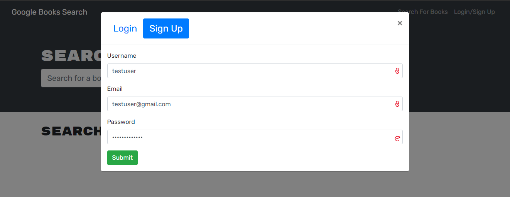
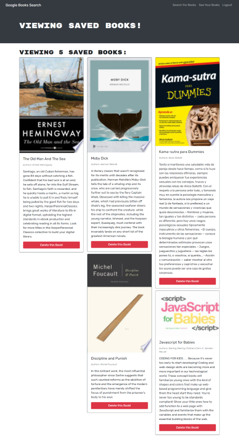

# Book Search Engine   
 

## Description

 

Book-Search-Engine is a personalized google-powered book repository.  Create an account, search for books, save your favorites to your profile.  This app is built with the MERN stack and seamlessly ties the back end with the front.  

 

## Acceptance Criteria

 

- **GIVEN a book search engine:**

 

- [x] WHEN I load the search engine.
    - THEN I am presented with a menu with the options Search for Books and Login/Signup and an input field to search for books and a submit button
- [x] WHEN I click on the Search for Books menu option
    - THEN I am presented with an input field to search for books and a submit button
- [x] WHEN I am not logged in and enter a search term in the input field and click the submit button
    - THEN I am presented with several search results, each featuring a book’s title, author, description, image, and a link to that book on the Google Books site
- [x] WHEN I click on the Login/Signup menu option
    - THEN a modal appears on the screen with a toggle between the option to log in or sign up
- [x] WHEN the toggle is set to Signup
    - THEN I am presented with three inputs for a username, an email address, and a password, and a signup button
- [x] WHEN the toggle is set to Login
    - THEN I am presented with two inputs for an email address and a password and login button
- [x] WHEN I enter a valid email address and create a password and click on the signup button
    - THEN my user account is created and I am logged in to the site
- [x] WHEN I enter my account’s email address and password and click on the login button
    - THEN I the modal closes and I am logged in to the site
- [x] WHEN I am logged in to the site
    - THEN the menu options change to Search for Books, an option to see my saved books, and Logout
- [x] WHEN I am logged in and enter a search term in the input field and click the submit button
    - THEN I am presented with several search results, each featuring a book’s title, author, description, image, and a link to that book on the Google Books site and a button to save a book to my account
- [x] WHEN I click on the Save button on a book
    - THEN that book’s information is saved to my account
- [x] WHEN I click on the option to see my saved books
    - THEN I am presented with all of the books I have saved to my account, each featuring the book’s title, author, description, image, and a link to that book on the Google Books site and a button to remove a book from my account
- [x] WHEN I click on the Remove button on a book
    - THEN that book is deleted from my saved books list
- [x] WHEN I click on the Logout button 
    - THEN I am logged out of the site and presented with a menu with the options Search for Books and Login/Signup and an input field to search for books and a submit button  

 

## **Table of Contents**

 

* *[Installation](#installation)*
* *[Screenshots](#screenshots)*
* *[Usage Instructions](#usage-instructions)*
* *[Contributing](#contributing)*
* *[Technology](#technology)*
* *[Tests](#tests)*
* *[Questions](#questions)*
* *[License](#license)*

 

## **Installation**

 

After cloning/forking the applications use the command `npm i` or `npm install` to download the necessary dependencies.

 

## **Screenshots**

 

**Signing up:**

 

**Searching for books:**

 

**Saved books:**

## **Usage-instructions**

 

To test this application, or to run it locally use the command `npm start` to activate the server.  You may now navigate to `localhost:3001`.   

 

## **Contributing**

 

Please refer to the **[Contributor Covenant](https://www.contributor-covenant.org/)** for contribution guidelines.

 

## **Technology**

 

**This project was completed using:** 

 

- `Apollo`
- `b-crypt`
- `BootStrap`
- `concurrently`
- `Express`
- `GraphQL`
- `Heroku`
- `if-env`
- `jsonwebtoek`
- `jwt-decode`
- `MongoDB`
- `Mongoose`
- `Node.js`
- `React`

 

## **Tests**  

 

No test need to be run at this time. 

 

## **Questions**

 

For any questions, comments, or feedback please feel free to reach out:  
- **[Github](https://github.com/gintstir)** 
- **<gint.stirbys@gmail.com>**

 

## **License** 

 

Copyright © **Gintautas Stirbys**, **2021**.  All Rights Reserved.

This Project is licensed under the **[Apache~2.0](https://www.apache.org/licenses/LICENSE-2.0)** license.

